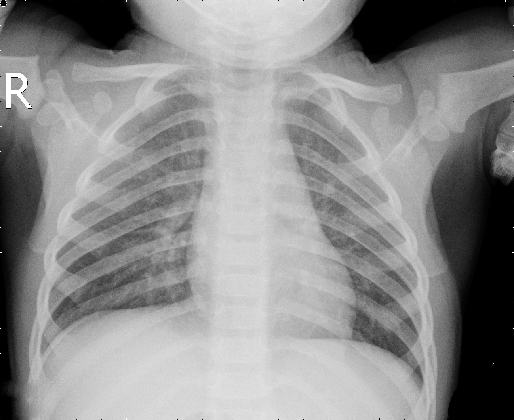
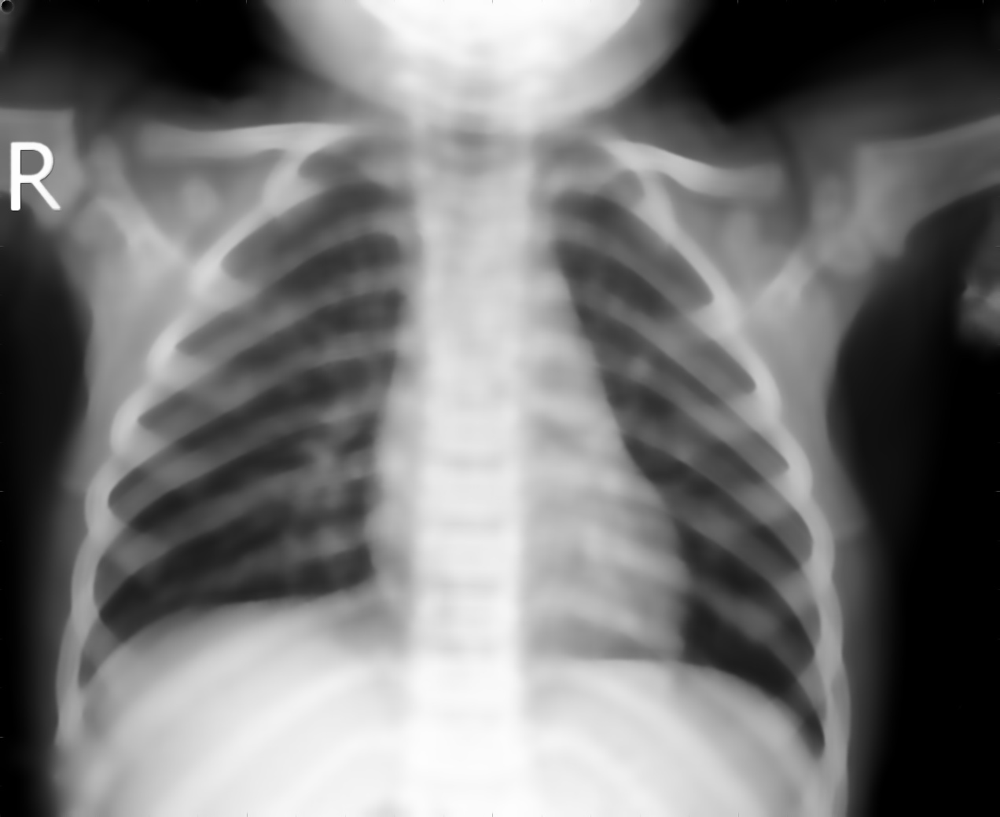
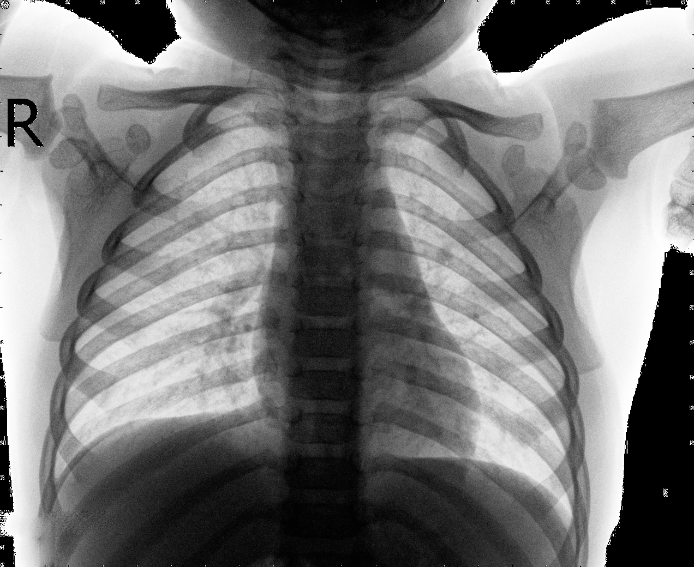

# Image Denoising Project

This Python-based project offers a solution for denoising X-ray images through the implementation of Non-Local Means (NLM) and Wavelet Transform methods. Designed with an Object-Oriented Programming (OOP) approach, our project boasts modular and reusable components, making it an ideal foundation for further exploration in image processing techniques.

## Project Highlights
- **Modular Design:** Our OOP approach facilitates easy integration of additional image processing algorithms.
- **Focused on Medical Imaging:** Initial efforts concentrated on denoising X-ray images, crucial for accurate medical diagnosis.
- **Ready for Expansion:** Set up for straightforward hyperparameter tuning and testing of new denoising algorithms.

## Project Structure

Our codebase is neatly organized into modules within the `tools` directory, with each module dedicated to a specific aspect of the image denoising process:

- **`image_loader.py`**: Loads images from a directory.
- **`preprocessor.py`**: Performs initial image preprocessing (normalization, optional histogram equalization).
- **`denoiser.py`**: Applies NLM and Wavelet denoising techniques.
- **`evaluator.py`**: Calculates the Peak Signal-to-Noise Ratio (PSNR) for performance evaluation.
- **`visualizer.py`**: Generates visual comparisons between original and denoised images.
- **`image_saver.py`**: Saves processed images to the filesystem.
- **`experiment.py`**: Orchestrates the workflow, including loading, preprocessing, denoising, and evaluation.
- **`main.py`**: The entry point for executing the image denoising experiment.

## Getting Started

1. Clone the repository.
2. Place relevant images under the `images/` directory (adjust the variable name in `main.py` as needed).
3. Run the pipeline:

```sh
python main.py
```
The denoising results, including PSNR values and processed images, are saved in `/path_to_save_processed_images`. An `experiment_results.csv` file with the PSNR values is also generated for analysis.

## Logging

Logs are maintained in `image_processing.log` in the project root, tracking processing steps and errors.

## Sample Experiment Insights

### Dataset

Our preliminary experiments utilized the "Chest X-Ray Images (Pneumonia)" dataset from Kaggle.

### Results Overview


Original image


NLM image


Wavelet image


- **NLM Technique:** Offers excellent edge preservation but may result in over-smoothing. Fine-tuning the 'h' parameter is crucial.
- **Wavelet Technique:** Excellently retains detail by isolating noise through multi-resolution analysis. Ensuring accurate wavelet coefficient handling and inverse transform application is key.

### Evaluation Metric

We employ PSNR, calculated as follows, to evaluate denoising performance:


For instance, `NORMAL2-IM-1440-0001.jpeg` achieved a PSNR of approximately 7.32 with NLM and 17.95 using the Wavelet method, underscoring the superior image quality preservation of the latter.

## Improvements and Future Directions

- **Varied Dataset:** Testing with a more diverse dataset to enhance model robustness.
- **CNN Compatibility:** Exploring the potential of improved training data for CNNs, particularly for diagnosing pneumonia.
